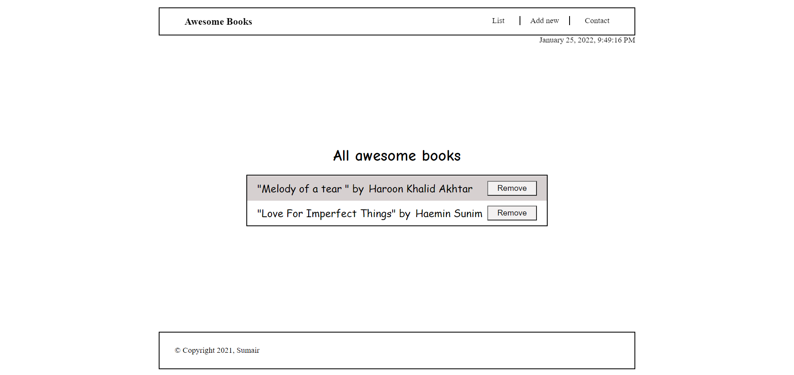

# Awesome Books with es6 modules

> A project that is the continuation of Awesome books library application built using ES6 modules.

## Built With

- JavaScript
- HTML
- CSS

## Live Demo

[Live Demo Link](https://livedemo.com)

## Getting Started

Just clone the repository using the link (https://github.com/sumairq/Awesome-Books-ES6.git)

## Authors

👤 **Sumair Qaisar Jadoon**

- GitHub: [@sumairq](https://github.com/sumairq)
- Twitter: [@sumair_qaisar](https://twitter.com/sumair_qaisar)
- LinkedIn: [LinkedIn](https://linkedin.com/in/sumair-qaisar-jadoon-84a877164)

## 🤝 Contributing

Contributions, issues, and feature requests are welcome!

Feel free to check the [issues page](../../issues/).

## Show your support

Give a ⭐️ if you like this project!

## Acknowledgments

- Hat tip to anyone whose code was used
- Inspiration
- etc

## 📝 License

This project is [MIT](./MIT.md) licensed.
